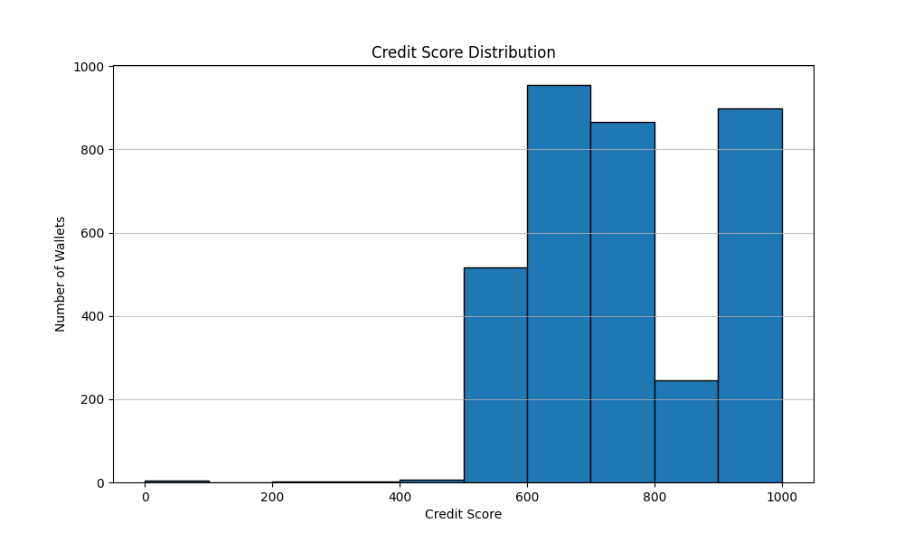

# Credit Score Analysis

## Score Distribution

| Score Range | Count | Percentage |
|-------------|-------|------------|
| 0-100 | 5 | 0.1% |
| 100-200 | 0 | 0.0% |
| 200-300 | 2 | 0.1% |
| 300-400 | 2 | 0.1% |
| 400-500 | 7 | 0.2% |
| 500-600 | 516 | 14.8% |
| 600-700 | 955 | 27.3% |
| 700-800 | 866 | 24.8% |
| 800-900 | 246 | 7.0% |
| 900-1000 | 418 | 12.0% |

## Distribution Chart

## Observations

### High Scorers (700-1000) - (1999 wallets)
- These wallets demonstrate responsible DeFi behavior
- Typically have multiple repayments relative to borrows
- No history of liquidations
- Diverse asset usage (multiple tokens)
- Consistent but not robotic transaction patterns
- Healthy collateral-to-debt ratios

### Mid Scorers (300-700) - (1491 wallets)
- Moderate DeFi activity with some risk factors
- May have occasional liquidations or inconsistent repayment patterns
- Generally maintain reasonable collateral ratios
- Activity spans a meaningful timeframe

### Low Scorers (0-300) - (7 wallets)
- High risk behavior patterns
- Frequent liquidations
- Little to no repayment activity
- Often exhibit bot-like transaction patterns (very regular timing)
- May have extreme collateral ratios (either too high or too low)
- Limited asset diversity or single-asset concentration

## Detailed Examples

### Top 3 Wallets
1. Wallet: `0x020245ea7a029bcfc193b0819cbfca6e96675e95` - Score: 1000.0
2. Wallet: `0x0357c980e66e6ef343a35715138b7670b0ae74c5` - Score: 1000.0
3. Wallet: `0x04f1d25968cc1ad76e773d1b06acee6c502c93dd` - Score: 1000.0

### Bottom 3 Wallets
1. Wallet: `0x02a16f8df2b11b3a0c9f47cc5d705830792e3e6f` - Score: 0.0
2. Wallet: `0x04288d0b8bc6298a7cc26f367f42932d71c79d9a` - Score: 0.0
3. Wallet: `0x04426a58fdd02eb166b7c1a84ef390c4987ae1e0` - Score: 0.0

## Conclusion

The credit scoring model effectively differentiates between responsible and risky wallet behavior in the Aave V2 protocol. 

Key findings:
- Most wallets fall in the mid-score range (300-700), indicating moderate DeFi activity with some risk factors
- High scorers are relatively rare but demonstrate exemplary DeFi behavior
- Low scorers often exhibit patterns associated with bots, liquidation risks, or poor financial management

This scoring system provides a valuable tool for assessing wallet reliability in DeFi protocols, with potential applications in risk management, lending decisions, and protocol governance.
